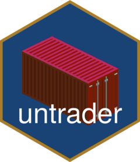
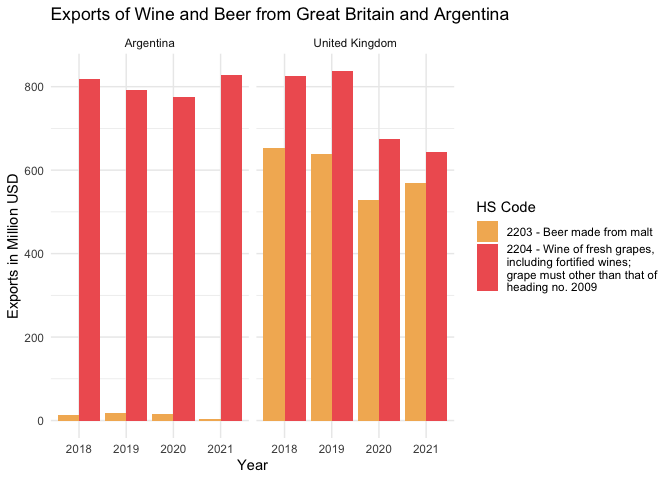

<!-- README.md is generated from README.Rmd. Please edit that file -->

# untrader <a href="https://datapumpernickel.github.io/untrader/"></a>

<!-- badges: start -->

[](https://github.com/datapumpernickel/untrader/actions/workflows/R-CMD-check.yaml)
<!-- badges: end -->

## 🚧 Under development - Looking for help 🤗

The goal of untrader is to provide a simple wrapper function for the new
[Comtrade API of the UN](https://comtradeplus.un.org/). The legacy API
was very nicely wrapped in the
[comtradr](https://github.com/ropensci/comtradr) package. Since there
have been extensive changes to the API, I have decided to have a clean
start with a new wrapper for the new API. However, a lot of the
structure and set-up has been inspired from the original `comtradr`
package and one function (check_date() function) has been entirely
copied over with minor changes.

Let me know, if you would like to be part of the developing process and
help maintain the package!

## Installation

You can install the development version of untrader like so:

``` r
devtools::install_github('datapumpernickel/untrader')
```

## Example

This is a basic example which shows you how to solve a common problem:

``` r
library(untrader)
library(ggplot2)
library(stringr)

## you need to set your API key first
# set_primary_comtrade_key()

exports <- get_comtrade_data(frequency =  'A',
                   commodity_classification = 'HS',
                   commodity_code = c('2204','2203'),
                   flow_direction = 'export',
                   reporter = c("ARG","GBR"),
                   partner = 'world',
                   start_date = "2018",
                   end_date = "2021",
                   verbose = T,
                  process = T)
#> ✔ Checked validity of frequency!
#> ✔ Checked validity of commodity_classification.
#> ✔ Checked validity of flow_direction.
#> ✔ Checked validity of commodity_code.
#> ✔ Checked validity of reporter.
#> ✔ Checked validity of partner.
#> ✔ Checked validity of period.
#> ℹ URL that will be queried:
#>   https://comtradeapi.un.org/data/v1/get/C/A/HS?cmdCode=2204%2C2203&flowCode=X&partnerCode=0&reporterCode=32%2C826&period=2018%2C2019%2C2020%2C2021&motCode=0&partner2Code=0&customsCode=C00
#> ℹ Performing request, which can take a few seconds, depending on the amount of
#>   data queried
#> ✔ Got a response object from Comtrade. Use `process = F` if there is an error
#>   after this step to find issues with the response object.


str(exports)
#> 'data.frame':    16 obs. of  52 variables:
#>  $ reporterCode            : int  32 32 826 826 32 32 826 826 32 32 ...
#>  $ partnerCode             : int  0 0 0 0 0 0 0 0 0 0 ...
#>  $ cmdCode                 : chr  "2203" "2204" "2203" "2204" ...
#>  $ typeCode                : chr  "C" "C" "C" "C" ...
#>  $ freqCode                : chr  "A" "A" "A" "A" ...
#>  $ refPeriodId             : int  20180101 20180101 20180101 20180101 20190101 20190101 20190101 20190101 20200101 20200101 ...
#>  $ refYear                 : int  2018 2018 2018 2018 2019 2019 2019 2019 2020 2020 ...
#>  $ refMonth                : int  52 52 52 52 52 52 52 52 52 52 ...
#>  $ period                  : chr  "2018" "2018" "2018" "2018" ...
#>  $ reporterISO             : logi  NA NA NA NA NA NA ...
#>  $ reporterDesc            : logi  NA NA NA NA NA NA ...
#>  $ flowCode                : chr  "X" "X" "X" "X" ...
#>  $ flowDesc                : logi  NA NA NA NA NA NA ...
#>  $ partnerISO              : logi  NA NA NA NA NA NA ...
#>  $ partnerDesc             : logi  NA NA NA NA NA NA ...
#>  $ partner2Code            : int  0 0 0 0 0 0 0 0 0 0 ...
#>  $ partner2ISO             : logi  NA NA NA NA NA NA ...
#>  $ partner2Desc            : logi  NA NA NA NA NA NA ...
#>  $ classificationCode      : chr  "H5" "H5" "H5" "H5" ...
#>  $ classificationSearchCode: chr  "HS" "HS" "HS" "HS" ...
#>  $ isOriginalClassification: logi  TRUE TRUE TRUE TRUE TRUE TRUE ...
#>  $ cmdDesc                 : logi  NA NA NA NA NA NA ...
#>  $ aggrLevel               : logi  NA NA NA NA NA NA ...
#>  $ isLeaf                  : logi  NA NA NA NA NA NA ...
#>  $ customsCode             : chr  "C00" "C00" "C00" "C00" ...
#>  $ customsDesc             : logi  NA NA NA NA NA NA ...
#>  $ mosCode                 : chr  "0 " "0 " "0 " "0 " ...
#>  $ motCode                 : int  0 0 0 0 0 0 0 0 0 0 ...
#>  $ motDesc                 : logi  NA NA NA NA NA NA ...
#>  $ qtyUnitCode             : int  7 7 7 7 7 7 7 -1 7 7 ...
#>  $ qtyUnitAbbr             : logi  NA NA NA NA NA NA ...
#>  $ qty                     : num  2.30e+07 2.69e+08 5.34e+08 1.23e+08 2.98e+07 ...
#>  $ isQtyEstimated          : logi  FALSE FALSE TRUE TRUE FALSE FALSE ...
#>  $ altQtyUnitCode          : int  7 7 -1 -1 7 7 -1 -1 7 7 ...
#>  $ altQtyUnitAbbr          : logi  NA NA NA NA NA NA ...
#>  $ altQty                  : num  2.30e+07 2.69e+08 0.00 0.00 2.98e+07 ...
#>  $ isAltQtyEstimated       : logi  FALSE FALSE FALSE FALSE FALSE FALSE ...
#>  $ netWgt                  : num  2.44e+07 2.69e+08 5.37e+08 1.35e+08 3.05e+07 ...
#>  $ isNetWgtEstimated       : logi  FALSE FALSE TRUE TRUE FALSE FALSE ...
#>  $ grossWgt                : num  NA NA 0 0 0 0 0 0 0 0 ...
#>  $ isGrossWgtEstimated     : logi  FALSE FALSE FALSE FALSE FALSE FALSE ...
#>  $ cifvalue                : num  NA NA NA NA NA NA NA NA 0 0 ...
#>  $ fobvalue                : num  1.39e+07 8.20e+08 6.53e+08 8.25e+08 1.72e+07 ...
#>  $ primaryValue            : num  1.39e+07 8.20e+08 6.53e+08 8.25e+08 1.72e+07 ...
#>  $ legacyEstimationFlag    : int  0 0 0 0 0 0 2 6 0 0 ...
#>  $ isReported              : logi  FALSE FALSE FALSE FALSE FALSE FALSE ...
#>  $ isAggregate             : logi  TRUE TRUE TRUE TRUE TRUE TRUE ...
#>  $ cmd_description         : chr  "2203 - Beer made from malt" "2204 - Wine of fresh grapes, including fortified wines; grape must other than that of heading no. 2009" "2203 - Beer made from malt" "2204 - Wine of fresh grapes, including fortified wines; grape must other than that of heading no. 2009" ...
#>  $ partner_iso3c           : chr  "W00" "W00" "W00" "W00" ...
#>  $ partner_description     : chr  "World" "World" "World" "World" ...
#>  $ reporter_iso3c          : chr  "ARG" "ARG" "GBR" "GBR" ...
#>  $ reporter_description    : chr  "Argentina" "Argentina" "United Kingdom" "United Kingdom" ...

ggplot(exports) +
  geom_col(aes(
    x = period,
    y = primaryValue / 1000000,
    fill = str_wrap(cmd_description,30)
  ),
  position = 'dodge') +
  facet_wrap(. ~ reporter_description) +
  theme_minimal() +
  scale_fill_manual(name = "HS Code", values = c('#F3B562','#F06060'))+
  ylab("Exports in Million USD") +
  xlab("Year") +
  labs(title = 'Exports of Wine and Beer from Great Britain and Argentina')
```



## Next steps

- [ ] Implement the different modes of transportation and different
  commodity codes, as well as customCodes and partner2codes

- [ ] Implement access to the services API

- [ ] Include some more links to the UN Comtrade API FAQ.
